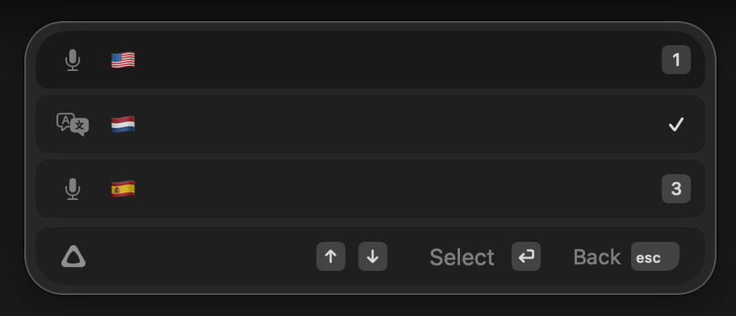

# superwhisper-swiftbar

A [SwiftBar](https://swiftbar.app) plugin that shows your active [superwhisper](https://superwhisper.com) mode in the macOS menu bar.

If you use superwhisper with multiple modes — say, one per language — this gives you a persistent at-a-glance indicator of which mode is currently selected, right in the menu bar.



## Features

- Displays the active mode name (emoji, text, whatever you named it) in the menu bar
- Click to see details: whisper model, language model, and all known modes
- Updates every 2 seconds — mode switches appear almost instantly
- Learns mode names automatically from your recording history
- Zero configuration required

## How it works

superwhisper stores an internal mode key (like `"default"`) in its preferences, but **not** the display name you assign in the UI. The plugin bridges this gap by watching the recording database: each time you dictate something, it maps the currently active internal key to the mode name from that recording. After one dictation per mode, all your mode names are learned and persist across restarts.

Mapping cache is stored at `~/.cache/superwhisper-swiftbar/`.

## Requirements

- macOS 13.3+
- [superwhisper](https://superwhisper.com) installed
- [SwiftBar](https://swiftbar.app) installed ([GitHub releases](https://github.com/swiftbar/SwiftBar/releases) or `brew install --cask swiftbar`)
- `sqlite3` (ships with macOS)

## Installation

1. **Install SwiftBar** if you haven't already:

   ```bash
   brew install --cask swiftbar
   ```

   Or download directly from [GitHub releases](https://github.com/swiftbar/SwiftBar/releases/latest).

2. **Launch SwiftBar** and choose a plugin directory when prompted (e.g. `~/Documents/swiftbar`).

3. **Copy the plugin** into your SwiftBar plugin directory:

   ```bash
   curl -fsSL https://raw.githubusercontent.com/Burbank/superwhisper-swiftbar/main/superwhisper-mode.2s.sh \
     -o "$(defaults read com.ameba.SwiftBar PluginDirectory)/superwhisper-mode.2s.sh"
   chmod +x "$(defaults read com.ameba.SwiftBar PluginDirectory)/superwhisper-mode.2s.sh"
   ```

4. **SwiftBar picks it up automatically.** If not, click the SwiftBar icon and choose *Refresh All*.

5. **Dictate once in each mode** so the plugin can learn the mapping between internal keys and your display names. After that, everything is automatic.

## Tip: name your modes with flag emoji

If you use superwhisper for multiple languages, renaming your modes to flag emoji (🇺🇸, 🇳🇱, 🇪🇸, …) makes for a compact, instantly recognizable menu bar indicator.

## Refresh interval

The filename `superwhisper-mode.2s.sh` tells SwiftBar to run the script every 2 seconds. You can rename the file to adjust — e.g. `superwhisper-mode.5s.sh` for every 5 seconds, or `superwhisper-mode.1s.sh` for every second.

## License

MIT
